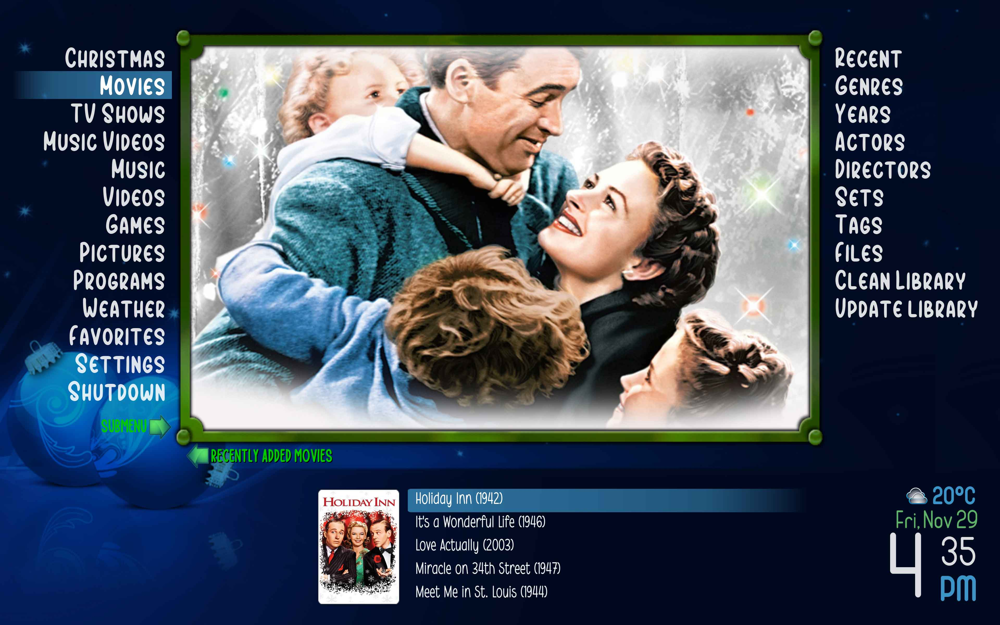
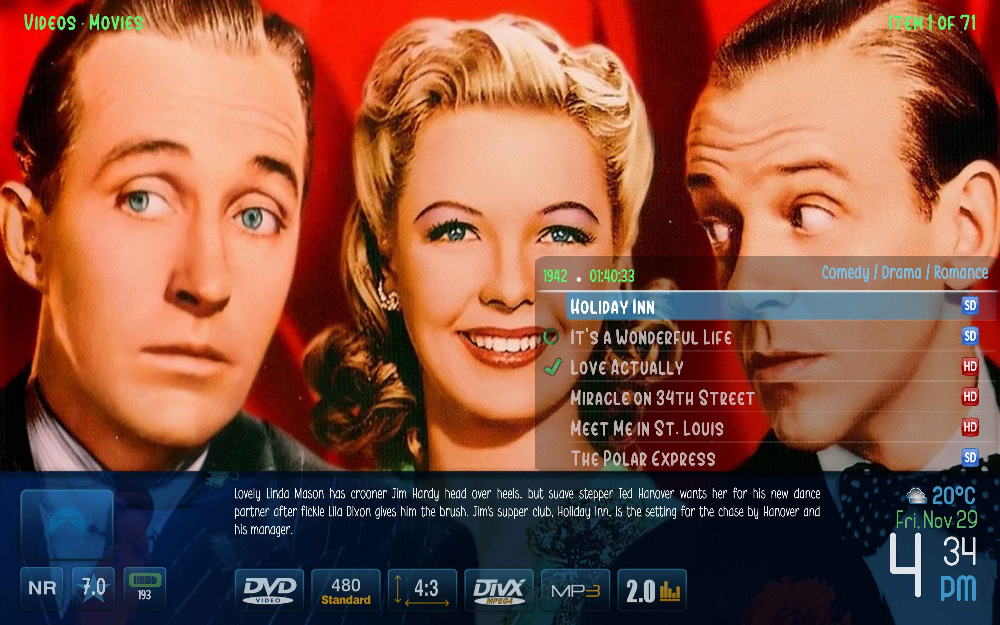
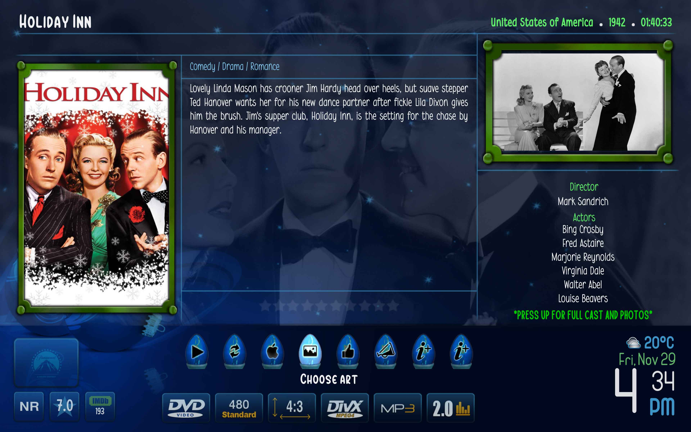
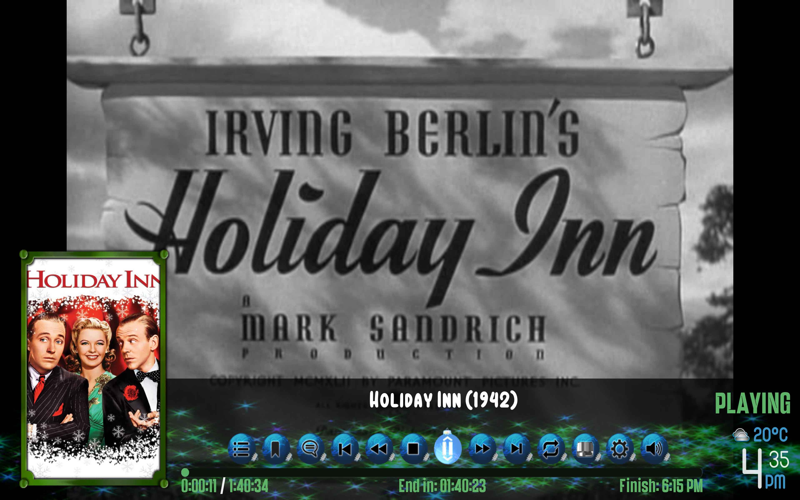
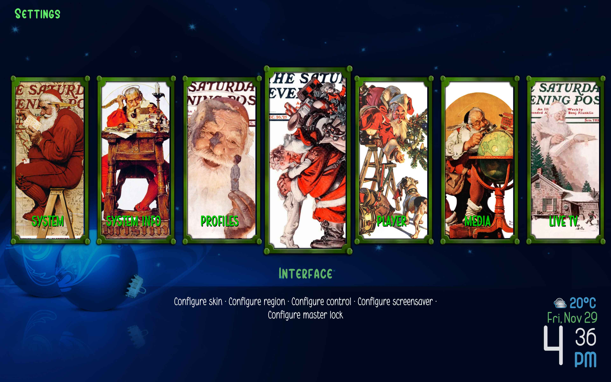

# metropolis-christmas-theme
Christmas Theme for Kodi Metropolis Skin

The theme provides a bunch of Christmas graphics, changes some of the colors, and provides new fonts.

To install just take [metropolis-christmas-theme.zip](https://github.com/smfontes/metropolis-christmas-theme/releases/download/V1.0/metropolis-christmas-theme.zip) under releases and unzip it in the addons/skin.metropolis/ directory.

Home Screen:

Movie Listing:

Movie Info:

Movie OSD:

Settings:

